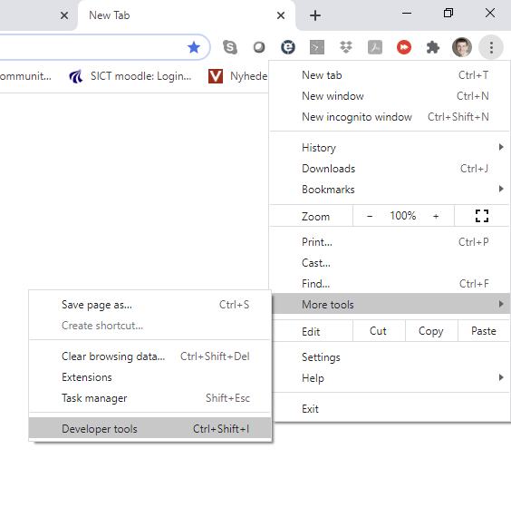
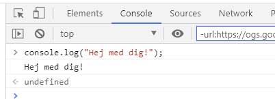
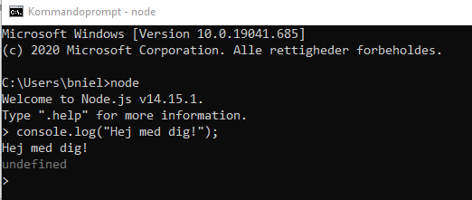
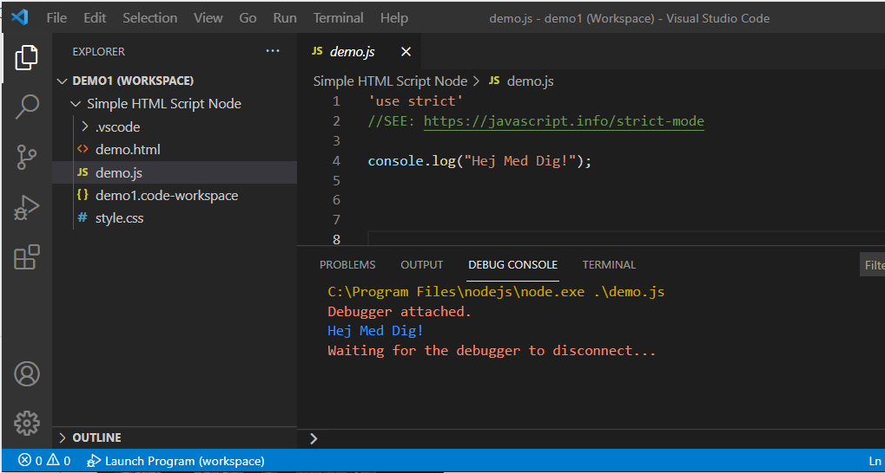

[< back](README.md)

# Exercises 1

## Part 1: Basic tool installation and usage:

1. Install the basic developer tools:
    1. [Chrome Browser](https://www.google.com/chrome/)
    2. [Visual Studio Code](https://code.visualstudio.com/) (the videos below could also be help full)
        - Getting started: [https://code.visualstudio.com/docs/introvideos/basics](https://code.visualstudio.com/docs/introvideos/basics) 
        - Later, [watch the intro video](https://youtu.be/VqCgcpAypFQ)

2. [node.js](https://nodejs.org/en/download/) (Choose a  LTS (long term stable) version, currently 16.13.2)

3. Using Chrome, locate the developer tools `(CTRL-SHIFT-I)`. Then locate the console-window (console in the menu-bar).
    `Type console.log("Hej med dig!");`

4. Next declare a variable `a` with value 40 and a constant `b` with value 2, and a variable `c` that equals the sum of `a` and `b`. Recall the `let` and `const` syntax from the lecture!
    
    
    

5. Redo exercise 4 and 5 using the node interpreter.
    
    

6. Loading and running files. The following exercises is most conveniently done using a proper code editor. You may use Emacs, or as recommended in this course the **Visual Studio Code** editor. You can use the [following files](https://www.moodle.aau.dk/pluginfile.php/2447165/mod_page/content/41/Simple%20HTML%20Script%20Node.zip?time=1612176359838) as a starting point. Unzip them into a suitable location.
    - To run in a browser, open the `demo.html` file (than in turn will load your script). Inspect the browsers javascript console.
    - To run in node.js, open a command line, change directory to the location inside the downloaded archive. Then type `node demo,js`
    - You may also run it in node from within VSCode (assume that you open the included workspace file in VSCode). Here there are two options, either run it in the built-in terminal, or better using the built-in DEBUGGER by pressing F5. The result is shown below. If the debug-console sub-window does not appear, you may need to enable it in the "View" menu.
    
    
    

## Part 2: Some JavaScript Programming assignments

1. \[MH\] p38 [Triangle](https://eloquentjavascript.net/02_program_structure.html#i_umoXp9u0e7) (Using iteration)

2. \[MH\] p38. [Chessboard](https://eloquentjavascript.net/02_program_structure.html#i_swb9JBtSQQ)

3. Here is a declaration of a JS function `renderPage` that accepts 3 strings `(title,heading,demoString)` as argument:
    `function renderPage(title,heading,demoString) { }`
    Complete its body such that it returns a string with [this contents](https://www.moodle.aau.dk/pluginfile.php/2447165/mod_page/content/41/demo%20-%20Kopi.txt) when called with `renderPage("Simpel IWP Demo", "IWP demo","JS Script er kørt")`. For the time being, you don't need to understand the contents of the string - just treat it as a black-box. **Try to use both string concatenation, and template literals.** Using string concatenation, like C you use backslash `\` to escape special characters like `"` and `\n` to produce newlines, and `\` directly followed by newline just breaks the string to the next line. Note that **template literals often are smarter** for this style of use. Print the string to the console and copy&paste it into an editor (plain notepad will suffice), save it as `myfile.html`. Load the file into a web-browser. This is a first taste of how scripts produce html.
    
    

4. Write a JS function that takes an array of strings as argument and computes (as return value) the average length of the strings. Ie. the following input it should compute (5 + 3 + 3) / 3 = 3,7.
    `let strings=["Hejsa", "med", "dig!"];`

## Part 3: Extra

Add recommended extensions for VisualStudioCode (when you have time)

- HTMLHint
- ESLint [https://eslint.org/](https://eslint.org/)
- Se også: [https://www.sitepoint.com/vs-code-extensions-javascript-developers/](https://www.sitepoint.com/vs-code-extensions-javascript-developers/)
