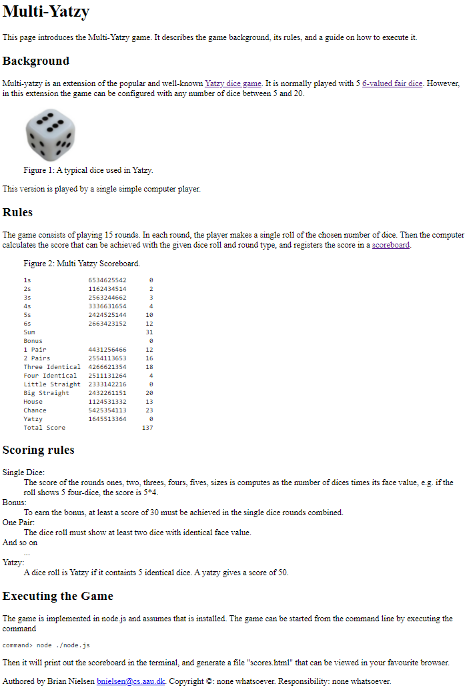
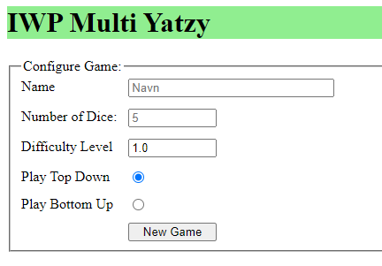
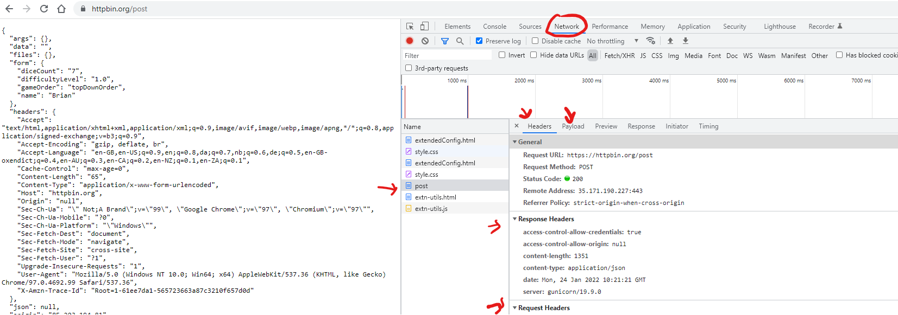

[< back](README.md)

# Exercises 3

## Part 1: HTML Markup

1. Warm up HTML exercises 
    1. [https://www.w3schools.com/html/exercise.asp?filename=exercise_html_headings3](https://www.w3schools.com/html/exercise.asp?filename=exercise_html_headings3)
    2. [https://www.w3schools.com/html/exercise.asp?filename=exercise_html_links5](https://www.w3schools.com/html/exercise.asp?filename=exercise_html_links5)
2. Yatzy HTML
    1. Do semantic HTML markup of a simple yatzy help page to be stored in the file "help.html".  After mark up, it ([raw text supplied for your convenience]) should display the page as shown below. It should include include a link to [https://da.wikipedia.org/wiki/Yatzy](https://da.wikipedia.org/wiki/Yatzy), and to your figures inside the page. You may use [this dice image](https://www.moodle.aau.dk/pluginfile.php/2447174/mod_page/content/15/3d-dice.png). Does your HTML pass the validator at [https://validator.w3.org/#validate_by_input](https://validator.w3.org/#validate_by_input)? (you can paste your html directly)

    

    2. This exercise extends the console yatzy with the capability of generating a html page of the scoreboard. [In this extended archive](https://www.moodle.aau.dk/pluginfile.php/2447174/mod_page/content/15/Yatzy%20-%20basic%20-%20HTML%20-%20Exercise.zip), a number of functions are appended that prints out the scoreboard in an html file. However, the author "forgot" to supply title and alternative text to the dice images. Add the javascript code to generate the title and alt attributes, such that the alternate text/title is "1-dice"  if the image is a one dice (as shown below, the title should be shown when hovering on the image).

    Also the page should include a relative link the the help page that you just authored, and another absolute to this wiki page: [https://da.wikipedia.org/wiki/Yatzy](https://da.wikipedia.org/wiki/Yatzy)

    

## Part 2: HTML Forms (VIGTIG)   

1. Forms Warm up
    1. [https://www.w3schools.com/html/exercise.asp?filename=exercise_html_forms2](https://www.w3schools.com/html/exercise.asp?filename=exercise_html_forms2)
    2. [https://www.w3schools.com/html/exercise.asp?filename=exercise_html_form_elements2](https://www.w3schools.com/html/exercise.asp?filename=exercise_html_form_elements2)
    3. [https://www.w3schools.com/html/exercise.asp?filename=exercise_html_form_input_types5](https://www.w3schools.com/html/exercise.asp?filename=exercise_html_form_input_types5)
    4. [https://www.w3schools.com/html/exercise.asp?filename=exercise_html_form_attributes2](https://www.w3schools.com/html/exercise.asp?filename=exercise_html_form_attributes2)
2. Yatzy game configuration form. 
    1. The lecture explained the HTML for setting up the game configuration form. Extend that HTML form to allow (a selection of) other game variation. E.g. a difficulty level factor (a required value between 1 and 2 in [steps](https://developer.mozilla.org/en-US/docs/Web/HTML/Attributes/step) of 0.1, default value 1.0): A difficulty level factor of 1.5 could mean that it is necessary to achieve a score 1.5\*30 to get bonus, and 1.5\*5 dice to get Yatzy, etc. The form should also offer a required choice of whether the game should be played in normal top-down order on the scoreboard or bottom up. The form should appear like the unstyled form illustrated below:
    
    
    
    (With simple styling the form could finally appear like the image below. DO NOT SPEND EXERCISE TIME ON DOING THIS STYLING: ONLY SHOWN FOR ILLUSTRATIVE PURPOSES!)

    

    2. In this exercise you are to inspect the data that is exchanged between a client and a server when the client submits a form using HTTP. 
        1. First, locate the browsers developer tools, and its network inspector. Since we don't have a server yet, we will use the a test server: httbin.org that simple sends back a json document with the data received from the client.  Change your form to point to the test server: 
        `<form action="https://httpbin.org/post" method="post">`
        Load the html page into the browser. You should now see the communication being listed, see illustration below.
        2. Inspect the exchanged header and body information in the request and response.
        What url is issued? What resource at the server is being accessed? what HTTP method?
        How is the form data sent to the server? What content-type?
        What is the content of the response? Does the request succeed?
        3. Do the same using the get method, i.e. change the form action/method to:
        `<form action="https://httpbin.org/get" method="get">`
    
    

## Part 3: a little bit on CSS

1. Some CSS exercises (after thinking it is OK to show answer)
      - [https://www.w3schools.com/css/exercise.asp?filename=exercise_selectors3](https://www.w3schools.com/css/exercise.asp?filename=exercise_selectors3)
      - [https://www.w3schools.com/css/exercise.asp?filename=exercise_selectors4](https://www.w3schools.com/css/exercise.asp?filename=exercise_selectors4)
      - [https://www.w3schools.com/css/exercise.asp?filename=exercise_combinators1](https://www.w3schools.com/css/exercise.asp?filename=exercise_combinators1)
      - [https://www.w3schools.com/css/exercise.asp?filename=exercise_combinators2](https://www.w3schools.com/css/exercise.asp?filename=exercise_combinators2)
      - [https://www.w3schools.com/css/exercise.asp?filename=exercise_positioning5](https://www.w3schools.com/css/exercise.asp?filename=exercise_positioning5)
      - [https://www.w3schools.com/css/exercise.asp?filename=exercise_pseudo_classes4](https://www.w3schools.com/css/exercise.asp?filename=exercise_pseudo_classes4)
      - [https://www.w3schools.com/html/exercise.asp?filename=exercise_html_classes3](https://www.w3schools.com/html/exercise.asp?filename=exercise_html_classes3)
