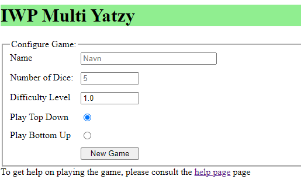
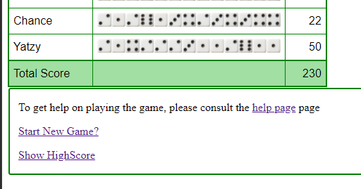
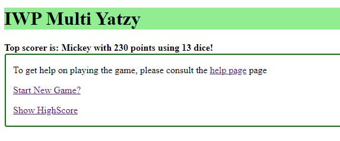

[< back](README.md)

# Exercises 4

## Part 1: 

Remaining exercises from last lecture.

## Part 2: Yatzy Site.

In this exercise session you will work with a [sample implementation of the MultiYatzy game](), developed as a web-site style application, where the presentation html is produced by Javascript at a server. The structure and key functions are presented in this video, that you need to watch first:

[https://www.moodle.aau.dk/pluginfile.php/2447177/mod_page/content/24/multi-yatzy-site.mp4?time=1613499087691](https://www.moodle.aau.dk/pluginfile.php/2447177/mod_page/content/24/Yatzy%20Node%20-%20Web%20-%202%20page%20V2%20%20EXERCISE.zip)
 
[Slides](https://www.moodle.aau.dk/pluginfile.php/2447177/mod_page/content/24/04-01%20multiyatzy.pdf)

1. Download the archieve, unzip, open the workspace file in VSCode (or open the JS files in your favorite browser). Start the server, either from within VSCode, or the command  node .\node/yatzy-server.js in the unzipped directory (On linux you may instead need to use node ./node/yatzy-server.js). Point your browser to `http://127.0.0.1:3000/` (or `http://localhost:3000/`). Try out a game or two.
2. Install the **`help.html` file** that you created last week, and put it in the proper directory. Which?
*Hint:* The server is written such that it re-directs resource paths that it does not understand (where no javascript function is attached) to the file-system, assuming a file need to be served instead. Remember that the client has no direct access to the server-side files. 
3. Try it out by viewing it in browser (accessed via the server, not filesystem). Which URL do you need to use?  
If necessary, adjust your relative paths in the html document (depends on how you exactly did the exercise). 
Try to get an overview of the two `yatzy-site.js` files (compared the video, the yatzy-site is split into two files: `yatzy-site-forms-handling.js` and `yatzy-site-game-control.js`, thereby hopefully being more comprehensible.
You **do not need to look at the `yatzy-server.js`** (in a later lecture will explain how to program a simple web server in node.js and route requests to javaScript functions. Further, the yatzy-game.js is similar to the game-logic that you have already investigated.
Locate the major pieces: the set of functions called by the server module, the yatzyController, the YatzyGame constructor functions (with the bulk of the code being html generation), and the generic HTML helper functions.
Yes, reading somebody else's code takes effort! Consider how will you deliver your own code to others?
4. **Add links:**
    - The front page (containing the "new game form" should contain a link to the help file.
    - Also, the page containing the scoreboard should contain the help link, and possibly another link to navigate "back" to the new-game allowing the user to easily start a new game. You decide if the restart link is always shown (a little easier) or only shown when the game has finished.
    - You may want to add a generic helper function that can construct/return a string containing an anchor element, given the destination url (and title) as parameters.    
    - Consider grouping these navigation links in an HTML nav-element! (could serve as a game menu appearing on all game pages.)
5. **Extended game configuration form.**
    - Extend the game configuration form to include the two additional inputs: difficulty level and game order, that you designed last week. Now, recall that the form is generated by a javascript function at the server side. Extend that function to emit the two input controls.
    *Hint:* Look for a function that prints the game form to HTML!

    
    

6. **Highscores**
    - The server supports a GET on the `/highscores` endpoint (e.g the resulting URL `http://localhost:3000/highscores`) and corresponding javascript function that currently returns an empty string to the client. Change it to return a HTML page with the current high-score
    First take the data from a test-data object containing the player name, score, number of used dice. 
7. Add a function that computes the high-scores, and use that instead of the test data. 
    - The required information can be extracted from the games array "database" (be sure to include only finished games). If you wish you can "normalise" the score to a per dice score-value. 
    - Advanced students may want to compute an array of top-N high scores, and format that as a high-score HTML table.  You could also add an input form that allows the user to input a name of whose highscores to list, and format a highscore table that is filtered by that name. In this case you MUST add a server-side validation function, and add a route to the server module.

    