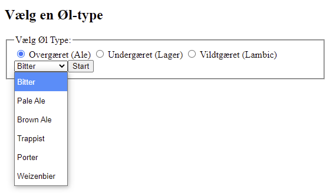
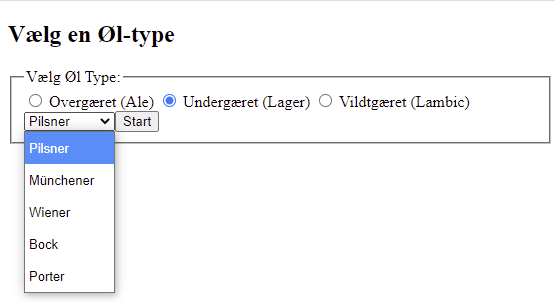
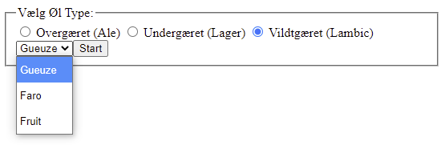
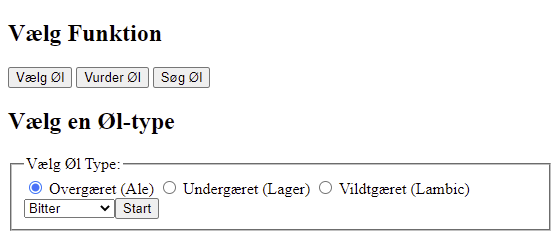
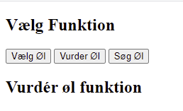
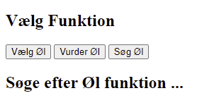
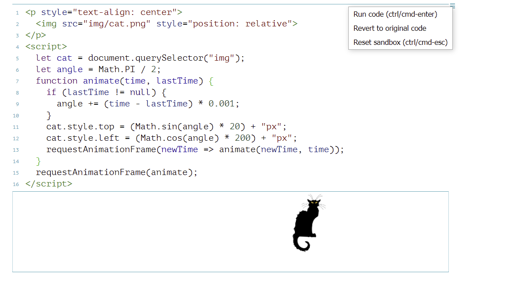

[< back](README.md)

# Exercises

1. Below you find the html for a (parts of a simple page for) entering the choice of beers. Add the javaScript to readout (print to console) the names  and statuses (whether they are checked or not) of the radio buttons. Your solution should work with a document containing further forms. It can be solved in several ways. 
*Hint:* radio-button elements has a boolean property `.checked` that indicates whether it is checked or not; the name is available in its  .value property. Use either `document.getElementById` (thereby needing to add the necessary id attributes) or the `document.querySelector`/`document.querySelectorAll` to get a javaScript object references to the buttons.  Further hint: you can use the CSS attribute selector `[]` to select element that has a specific attribute set. e.g `input[name="xxx"]` to find input elements with name set to "xxx"; 
   
```html
<!DOCTYPE html>
<html lang="da">
<head>
  <title>IWP Demo</title>
  <meta charset="UTF-8">
</head>
<body>   
  <form id="beerForm">
  <fieldset> <legend> Vælg Øl Type: </legend>
    <input type="radio" name="gæringstype" value="overgæret" checked> Overgæret (Ale)       
    <input type="radio" name="gæringstype" value="undergæret"> Undergæret (Lager)  
    <input type="radio" name="gæringstype" value="vildgæret" > Vildtgæret (Lambic)
    <input type="button" value="Start">
    </fieldset>
  </form>
  <script>    </script>    
</body>    
</html>
```

2. Use the DOM API to insert a `h1` element with the text "Vælg en Øl-type" immediately before the form: Use `document.createElement` to create a new element and the appropriate (Section 15.3.5 in \[DF\]) append, prepend, before, after method(s).

3. a) Attach an event-handler function to the start button (using `addEventListener`). The function should print the status of the radio buttons to the console (you may want to wrap you solution to Q1 as a function `listChecked` for this purpose). 

    b) Now do the same for each radio button, such that each button reacts to a click by logging the statuses (re-using your above function). 

4.  Make a spy functionality: Whenever the user hovers the mouse over an element on the page, this should be caught by an event-handler function that extracts information about the target HTML element (its `nodeName` and `innerHTML`; both available via the `target` property of the event object transferred to the event handler function (e.g `event.target.nodeName`) and logs it to the console. You can use the beer page, a page of your own, or the HTML from [http://people.cs.aau.dk/~bnielsen/IWP/links.html](http://people.cs.aau.dk/~bnielsen/IWP/links.html). It can be extended with a key-logger feature (listen for `keydown` events). (Not to be done in this exercise, but all you have to do then to make an effective spy script is to HTTP POST the logged entry using the fetch-api to a web-server (node.js application) under your control, and you are effectively remotely observing what the user is interested in (at least as indicated by the mouse position).


*Hint:* you can attach the event handler for the `mouseover` event to an outer HTML element such as `document.body` (or even the global window object); In this case also print out the event's currentTarget property to show the difference to the `target` property. 

5. Add the following script element: `<script src="http://people.cs.aau.dk/~bnielsen/IWP/test.js"></script>`
Load your html containing that element into your browser. Discuss the possible security implications of this. What if such a script could be "fetch"ed and executed from a script attached to your document? 

6. a) The objective of this exercise is to pretend that the following object has been received from a webserver and, based on this information, to build 3 [HTML select menu lists](https://developer.mozilla.org/en-US/docs/Web/HTML/Element/select) resp. for ales, lagers, wilds using the DOM functions. *Hint:* First, get comfortable with the select menu by constructing it as static HTML. Then make a function that uses DOM to construct the same element. Then develop a reusable function that takes an array of strings as argument (and an `id` attribute string for the menu) that returns the constructed HTML element. Insert the elements after the button. 

```javascript
  let beerTypes={
  ales: ["Bitter", "Pale Ale", "Brown Ale", "Trappist", "Porter",  "Weizenbier"],
  lagers:["Pilsner", "Münchener", "Wiener", "Bock", "Porter"],
  wilds: ["Gueuze", "Faro", "Fruit"]
  };
```

  b) Next, only the menu that corresponds to the selected beer type should be shown (ie there is one drop at a time). Hint: `replaceWith` and event-handlers on the radio buttons! The same handler function can be registered on all three buttons, and the exact target can be detected e.g using `event.target.value`

  
  
  

  c) As a final step, the beerTypes object should be "fetch"'ed from a server (i.e. contents not declared as an array at client). You can use the Yatzy-site server from last for this purpose: Deposit your `exercise.html` file (containing the script that does fetch on in the directory for HTML files. Also add a file `beer.json` that contains

```json
{"ales":["Bitter","Pale Ale","Brown Ale","Trappist","Porter","Weizenbier"],"lagers":["Pilsner","Münchener","Wiener","Bock","Porter"],"wilds":["Gueuze","Faro","Fruit"]}
```

Your java script is to fetch it using the "idiom" `fetch("/beers.json").then().then().catch();` See slides and textbook Section 15.11.1 p 519 

First, check that you receive the object by printing it to the console in the `.then()` after deserialisation of the json response. Then alter that call-back function to also present the fetched result to the gui (that will be the task of the call back function given to `.then`).

(This exercise is to mimic the situation where javaScript objects are retrieved from a server, and displayed to the user; here in a fancy style where the GUI elements are also tailored. )

7. (OPTIONAL) You may further expand the system above by adding a menu for choosing different functionality of the beer app: Add a `<nav>` element with a button for each functionality. For each functionality add a section containing the HTML for each section. Only the currently selected section should be shown. The functionality can be changed by clicking the corresponding function button. Hint: you can control the visibility of an element through the properties `display.style="none"` or `display.style="block"`. If you like, you can change the color or style of each button to indicate which function is activated. Instead of a "button" you can also use a `<div> FUNCTION </div>` to act like a button (easier to style), or use pictures as buttons. 

It could appear something like:





8. Animation (OPTIONAL)

Try out this simple animation demo [https://eloquentjavascript.net/14_dom.html#c_SCZYa8azNm](https://eloquentjavascript.net/14_dom.html#c_SCZYa8azNm) (remark you can run the example directly on the page using the "burger" menu, see picture

Then to the "Cats hat": [https://eloquentjavascript.net/14_dom.html#p_3jJ377egS/](https://eloquentjavascript.net/14_dom.html#p_3jJ377egS/)

