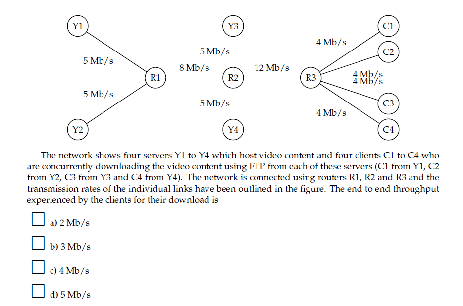

[< back](README.md)

# Exercises 9

Reserve the last 35 minutes for the practical exercises.

Review questions (Fra [KR Kapitel 1] p 95-97)

1. R1

2. R19,

3. R23,

4. R24

Problems (\[Kr\] p98-105)

1. [http://gaia.cs.umass.edu/kurose_ross/interactive/end-end-delay.php](http://gaia.cs.umass.edu/kurose_ross/interactive/end-end-delay.php)

2. [http://gaia.cs.umass.edu/kurose_ross/interactive/end-end-throughput-simple.php](http://gaia.cs.umass.edu/kurose_ross/interactive/end-end-throughput-simple.php)

3. Problem 6

4. Mulig eksamensopgave:

    

5. P25

6. Et streaming firma skal have uploadet et ny datasæt på 40 terabytes til en server, der er placeret tæt hos forbrugerne, men et stykke væk fra firmaet. Deres Internet forbindelse til serveren tillader en gennemsnitlig upload hastighed på 100 Mbps.   Hvor lang tid tager det? Sammenlig tid og pris med at sende en fysisk pakke med et speditionsfirma med næste-dags levering. Antag firmaet køber en dedikeret forbindelse til serveren, med 10 gange højere kapacitet. Hvor lang tid tager det så? Hvad bliver den gennemsnitlige udnyttelsesgrad af denne, under antagelse af at et nyt datasæt uploades en gang om måneden, og den daglige trafik (email, web-surfing, etc) udgør 20 Mbps i gennemsnit. Overvej de praktiske konsekvenser i scenariet.

Praktiske øvelser

- p18 (mest praktisk hjemmefra)
- Wireshark Lab (\[KR\] side 105)
    - Wireshark skal downloades fra dette site: [https://www.wireshark.org/download.html](https://www.wireshark.org/download.html), 
    - Bogens wireshark links: [https://gaia.cs.umass.edu/kurose_ross/wireshark.htm](https://gaia.cs.umass.edu/kurose_ross/wireshark.htm)
    - Bogens introduktion til wireshark: [http://www-net.cs.umass.edu/wireshark-labs/Wireshark_Intro_v7.0.pdf](http://www-net.cs.umass.edu/wireshark-labs/Wireshark_Intro_v7.0.pdf)
    - Bogens beskrivelse af analyse af HTTP traffik: [http://www-net.cs.umass.edu/wireshark-labs/Wireshark_HTTP_v7.0.pdf](http://www-net.cs.umass.edu/wireshark-labs/Wireshark_HTTP_v7.0.pdf)
    - Forsøg at lave opgave 1 i ovennævnte PDF: "1. The Basic HTTP GET/response interaction"